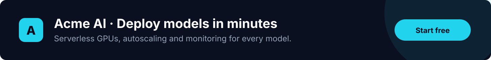
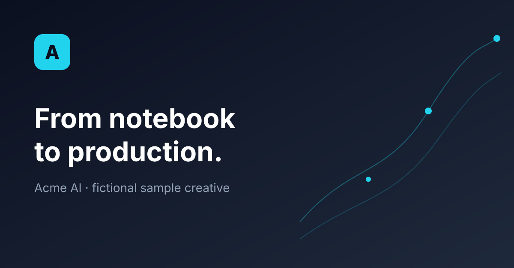

MLStation publishes in-depth, practical articles on machine learning, AI, statistics, software and deployment. Readers are engineers, data scientists, analysts and technical leaders who evaluate and buy tools.

## Why sponsor

- **A focused technical audience.** Every page is about building with data and AI.
- **Clean, respectful placements.** No pop-ups, no auto-play, and sponsored cards load no third-party trackers.
- **Clearly labelled.** Every placement is marked "Sponsored", which builds trust in your brand.
- **Relevant targeting.** Choose the sections that match your product: ML, AI, Statistics, Software or Deployment.

## Creative formats

The examples below use a fictional brand, Acme AI, to show how your creative will appear.

### Leaderboard

Full-width banner directly under the article title. The most visible placement.

```{=html}
<div class="ms-format">
  <a class="ms-ad ms-ad-banner" href="#" onclick="return false">
    <span class="ms-ad-label">Sponsored · Acme AI</span>
    
  </a>
  <div class="ms-format-meta"><span><b>Size</b> 1456 × 180 px (8:1)</span><span><b>File</b> PNG, JPG or SVG, under 150 KB</span><span><b>Where</b> under every article title</span></div>
</div>
```

### Spotlight

Image, logo and copy together inside the article, after the second section.

```{=html}
<div class="ms-format">
  <a class="ms-ad ms-ad-spotlight ms-ad-in-article" href="#" onclick="return false">
    <span class="ms-ad-label">Sponsored · Acme AI</span>
    
    <span class="ms-ad-spot-copy">
      <span class="ms-ad-body"><span class="ms-ad-copy"><strong>Deploy models in minutes</strong><span>Serverless GPUs, autoscaling and monitoring for every model you ship.</span></span></span>
      <span class="ms-ad-cta">Start free <i class="bi bi-arrow-right"></i></span>
    </span>
  </a>
  <div class="ms-format-meta"><span><b>Image</b> 1200 × 628 px (1.91:1)</span><span><b>Logo</b> square, 128 px or larger</span><span><b>Headline</b> up to 60 characters</span><span><b>Text</b> up to 140 characters</span></div>
</div>
```

### Sidebar card

Beside the article, under the table of contents. Visible for the whole read on desktop.

```{=html}
<div class="ms-format">
  <div class="ms-mock-sidebar">
    <a class="ms-ad ms-ad-sidebar" href="#" onclick="return false">
      <span class="ms-ad-label">Sponsored · Acme AI</span>
      <span class="ms-ad-body" style="flex-direction:column;gap:.5rem"><span class="ms-ad-copy"><strong>Monitor every model</strong><span>Drift alerts and dashboards in one line of code.</span></span></span>
      <span class="ms-ad-cta">Try it <i class="bi bi-arrow-right"></i></span>
    </a>
  </div>
  <div class="ms-format-meta"><span><b>Logo</b> square, 128 px or larger</span><span><b>Headline</b> up to 45 characters</span><span><b>Text</b> up to 90 characters</span></div>
</div>
```

### Native card

A text card at the end of articles, when readers look for tools to try.

```{=html}
<div class="ms-format">
  <a class="ms-ad ms-ad-article-end" href="#" onclick="return false">
    <span class="ms-ad-label">Sponsored · Acme AI</span>
    <span class="ms-ad-body"><span class="ms-ad-copy"><strong>Ship your first model today</strong><span>Free tier with GPU credits for new accounts.</span></span></span>
    <span class="ms-ad-cta">Get started <i class="bi bi-arrow-right"></i></span>
  </a>
</div>
```

### Sponsor logo row

Logos of current sponsors on the home page.

```{=html}
<div class="ms-format">
  <div class="ms-partners"><span class="ms-ad-label">Our sponsors</span>
    <div class="ms-partner-row">
      <span class="ms-partner"><span>Acme AI</span></span>
      <span class="ms-partner"><span>Northwind Cloud</span></span>
      <span class="ms-partner"><span>Quanta Labs</span></span>
    </div>
  </div>
</div>
```

## Packages

| Package | Includes | Price |
|---|---|---|
| Section sponsor | Every placement in one section (for example AI) for one month | Contact us |
| Leaderboard | Banner under the title of every article for one month | Contact us |
| Spotlight | In-article spotlight on every article for one month | Contact us |
| Starter | Sidebar and native cards for one month | Contact us |

## What we need from you

| Item | Details |
|---|---|
| Company name | As it should appear after "Sponsored" |
| Logo | Square SVG or PNG, at least 128 × 128 px |
| Spotlight image | 1200 × 628 px, optional |
| Leaderboard banner | 1456 × 180 px, optional |
| Headline and text | Up to 60 and 140 characters |
| Link | Landing page URL (tracking tags are added automatically) |
| Dates and sections | Start date, end date and sections to target |

## Guidelines

We accept products and services relevant to machine learning, AI, data, software, cloud infrastructure, hardware and engineering careers. We do not accept gambling, adult, misleading or unrelated offers. Sponsorship never influences editorial content, and every placement is labelled.

## Get in touch

Email [hello@mlstation.com](mailto:hello@mlstation.com?subject=Advertising%20on%20MLStation) with your company name, goals and preferred dates. We reply within two business days.
